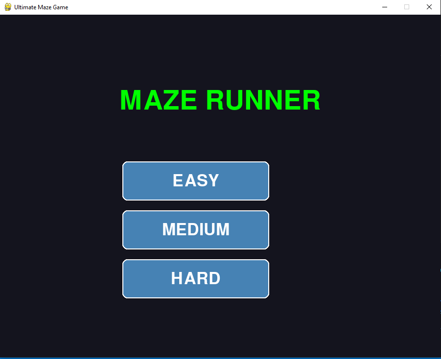
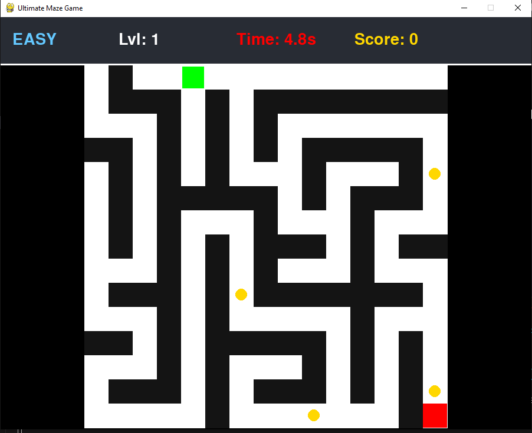

<div align="center">
    <h1> MAZE GAME </h1> 
    <p> THIS IS AN OPEN-SOURCE PROJECT </p>
</div>

<table align="center">
  <tr>
    <td align="center">
      <h4>SELECT LEVELs TYPE</h4>
      
    </td>
    <td align="center">
      <h4>FIRST-LEVEL STARTs</h4>
      
    </td>
  </tr>
</table>

---

**INTRODCUTION**: This is fun yet challenging open-source game develop for understanding the logic behind game creation using pygame module.

---

Requirements:

*   **Python 3.10** (or 3.11,3.12)
*   **Pygame**

To install the necessary library, run this command in your terminal:
```bash
pip install pygame